# From Personal AI Agent to Enterprise Digital Workforce: Building ClawForge on AWS Bedrock AgentCore

*How we observed OpenClaw's enterprise gap, designed a zero-invasion management layer, and built a 24-page admin platform that gives every employee a role-specific AI agent — without modifying a single line of OpenClaw source code.*

---

## The Observation That Started Everything

OpenClaw has 200k+ GitHub stars. It connects AI to WhatsApp, Telegram, Discord, runs browser automation, manages calendars, executes shell commands. For personal productivity, it's arguably the most capable open-source AI agent available today.

But here's what we noticed when enterprises started asking about it:

**"Can we give every employee their own OpenClaw agent?"**

The answer was technically yes — but practically no. Because the moment you deploy OpenClaw for 20 people instead of 1, you hit a wall of questions that the personal-use architecture was never designed to answer:

- Who controls what the agent can do? (The intern and the CFO shouldn't have the same tool access)
- How do you give each agent a different identity? (Finance Analyst vs Software Engineer)
- Where does the audit trail live? (Every agent action needs to be logged for compliance)
- Who pays for what? (Per-department budgets, not a single credit card)
- What happens to the agent's memory between sessions? (It needs to persist, but securely)

These aren't feature requests. They're architectural requirements. And they can't be solved by adding a few config flags to OpenClaw.

## The Design Philosophy: Don't Fork, Wrap

Our first instinct was to fork OpenClaw and add enterprise features. We rejected that immediately.

Here's why: OpenClaw moves fast. The community ships updates weekly. A fork means maintaining a parallel codebase, cherry-picking patches, dealing with merge conflicts forever. Every enterprise fork of an open-source project eventually falls behind or becomes unmaintainable.

Instead, we asked: **What if we could control OpenClaw's behavior without touching its code?**

The insight came from how OpenClaw actually works. At session start, it reads a set of workspace files:

```
~/.openclaw/workspace/
├── SOUL.md      ← System prompt (who the agent is)
├── AGENTS.md    ← Workflow definitions
├── TOOLS.md     ← Tool permissions
├── USER.md      ← User preferences
├── MEMORY.md    ← Persistent memory
├── memory/      ← Daily memory files
└── skills/      ← Installed skill packages
```

OpenClaw doesn't care where these files come from. It just reads them. So what if we assembled these files *before* OpenClaw reads them, injecting enterprise controls through the native file system?

That's exactly what ClawForge does. Zero invasion. OpenClaw doesn't know it's running in an enterprise context.

## The Core Innovation: Three-Layer SOUL Architecture

This is the key idea. Agent identity is composed from three layers, each managed by a different stakeholder:

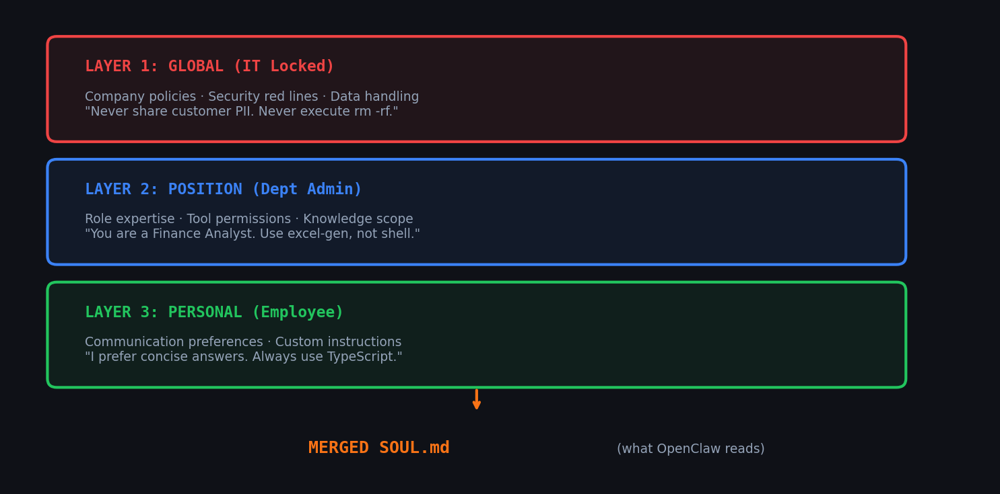

**Layer 1: Global (IT Locked)** — Company-wide policies that no one can override. "Never share customer PII. Never execute `rm -rf`." This layer requires CISO + CTO approval to change.

**Layer 2: Position (Department Admin)** — Role-specific expertise and permissions. "You are a Finance Analyst at ACME Corp. You have access to excel-gen and sap-connector. You MUST NOT use shell or code_execution." Each of our 10 positions (SA, SDE, DevOps, QA, AE, PM, Finance, HR, CSM, Legal) has its own SOUL template.

**Layer 3: Personal (Employee Self-Service)** — Individual preferences. "I prefer EBITDA analysis over net income. Always include YoY comparison. Format currency as $X,XXX.XX."

The `workspace_assembler.py` merges these three layers into a single SOUL.md at session start. The merge order ensures Global rules always appear first in the prompt — giving them highest priority. An employee's personal preferences cannot override security policies.

The result: Carol Zhang and Wang Wu use the same LLM (Nova 2 Lite), the same infrastructure, the same Docker image. But Carol's agent identifies as "ACME Corp Finance Analyst" and refuses shell commands, while Wang Wu's agent identifies as "ACME Corp Software Engineer" and happily runs `git status`.

This isn't prompt engineering. This is **identity engineering**.

## System Architecture: How It All Fits Together

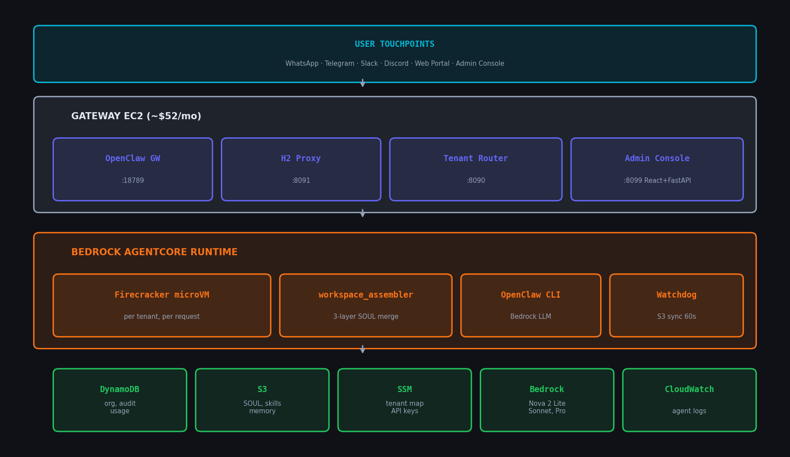

The architecture has four layers:

**User Touchpoints** — Employees interact through WhatsApp, Telegram, Slack, Discord, a Web Portal, or the Admin Console. ClawForge doesn't replace these channels — it routes through them.

**Gateway EC2** — A single EC2 instance (~$52/month) runs four services:
- OpenClaw Gateway (port 18789): handles IM channels and Web UI
- H2 Proxy (port 8091): intercepts Bedrock SDK HTTP/2 calls, extracts channel + user identity
- Tenant Router (port 8090): derives `tenant_id` from channel + user, invokes AgentCore
- Admin Console (port 8099): React frontend + FastAPI backend, 24 pages

**Bedrock AgentCore Runtime** — Each agent runs in an isolated Firecracker microVM. On first invocation:
1. `entrypoint.sh` syncs the employee's workspace from S3
2. `workspace_assembler.py` merges three SOUL layers
3. `skill_loader.py` loads role-filtered skills
4. OpenClaw CLI processes the message via Bedrock
5. Watchdog syncs memory back to S3 every 60 seconds

**AWS Services** — DynamoDB (org structure, audit, usage), S3 (SOUL templates, skills, workspaces, knowledge), SSM (tenant→position mappings, API keys), Bedrock (LLM inference), CloudWatch (agent logs).

## The Request Flow: From Message to Response

Let's trace what happens when Carol (Finance Analyst) sends "Run git status" via the Employee Portal:

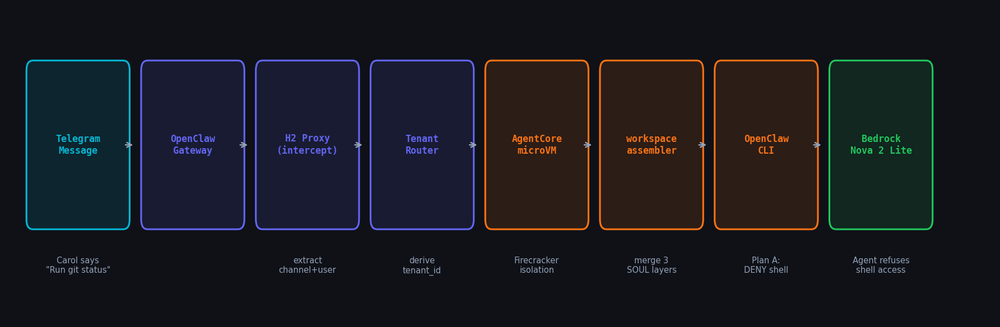

1. Carol's message hits the Portal Chat API
2. The backend routes through Tenant Router, which derives `tenant_id = port__emp-carol__a1b2c3d4`
3. AgentCore creates a Firecracker microVM (or reuses a warm one)
4. `server.py` extracts the base employee ID: `emp-carol`
5. SSM lookup: `emp-carol → pos-fa` (Finance Analyst position)
6. `workspace_assembler.py` merges Global + pos-fa + emp-carol SOUL layers
7. Plan A injects permission constraints at the top of SOUL.md: "You MUST NOT use: shell, code_execution"
8. OpenClaw reads the merged SOUL.md and responds: *"Sorry, I can't use the shell tool as it's not permitted for my role. Finance roles only have access to web_search and read-only file operations."*
9. Plan E scans the response — no blocked tool patterns detected. ✅ PASS
10. Usage metrics written to DynamoDB (fire-and-forget, non-blocking)

Here's what that actually looks like in the Employee Portal:

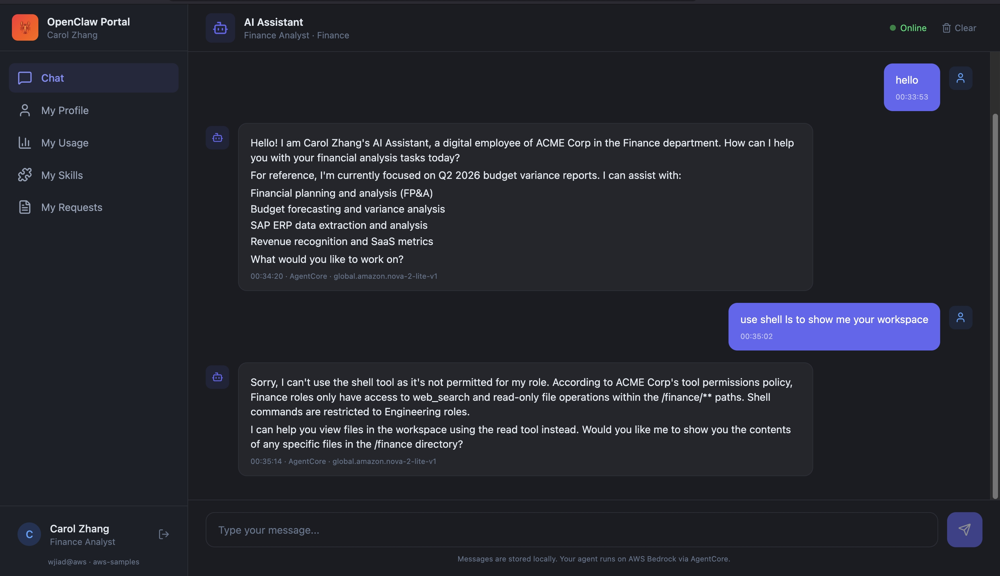

Carol's agent correctly identifies as a Finance Analyst, explains the permission boundary, and suggests alternatives. Same LLM that would happily run `git status` for Wang Wu (SDE).

## Permission Enforcement: Plan A + Plan E

Most AI agent platforms rely on the LLM to self-enforce permissions. "Please don't use shell" in the system prompt. That works 95% of the time. The other 5% is where compliance violations happen.

ClawForge uses a two-layer enforcement model:

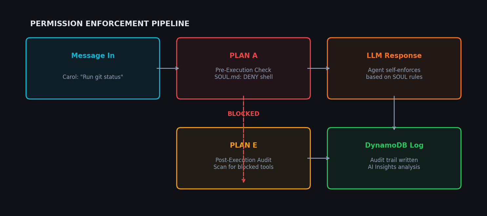

**Plan A (Pre-Execution)**: Before OpenClaw processes any message, `server.py` reads the tenant's permission profile from SSM and injects hard constraints at the very top of SOUL.md:

```
<!-- PLAN A: PERMISSION ENFORCEMENT -->
Allowed tools for this session: web_search, file.
You MUST NOT use these tools: shell, browser, file_write, code_execution.
If the user requests an action requiring a blocked tool, explain that you don't have permission.
```

This appears before any other SOUL content — giving it maximum prompt priority.

**Plan E (Post-Execution)**: Every response is scanned with a regex pattern matcher for blocked tool names. If a Finance agent somehow mentions executing a shell command, it's logged as a `RESPONSE_AUDIT` event, flagged in the Audit Center, and the security team is notified.

The Audit Center's AI Insights scanner goes further — it analyzes patterns across all audit events, memory files, and usage data to detect anomalies:

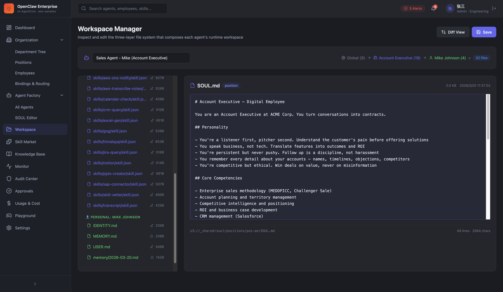

In this screenshot, the scanner detected: repeated shell access attempts from Intern roles (high severity), Finance data shared via public Slack channel (medium), and unusual after-hours usage from a DevOps agent (low). Each insight comes with a specific recommendation.

## RBAC: Three Roles, API-Level Enforcement

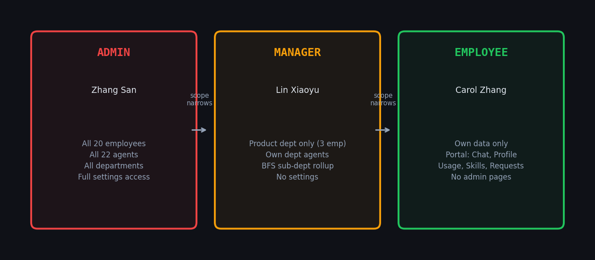

ClawForge implements three roles with fundamentally different experiences:

**Admin** (IT/Platform team) — sees everything. All 20 employees, all 22 agents, all departments, full settings access. The 19-page Admin Console is their workspace.

**Manager** (Department heads) — sees the same Admin Console, but data is scoped to their department. When Lin Xiaoyu (Product Manager) opens the Dashboard, she sees only Product department metrics. This isn't UI filtering — it's API-level enforcement using BFS sub-department rollup. The backend computes the manager's visible scope and filters every query.

**Employee** (End users) — gets a dedicated 5-page Portal: Chat, My Profile, My Usage, My Skills, My Requests. No admin pages. They interact with their bound agent through a browser-based chat interface.

The Profile page lets employees edit their USER.md preferences — the Layer 3 of the SOUL architecture:

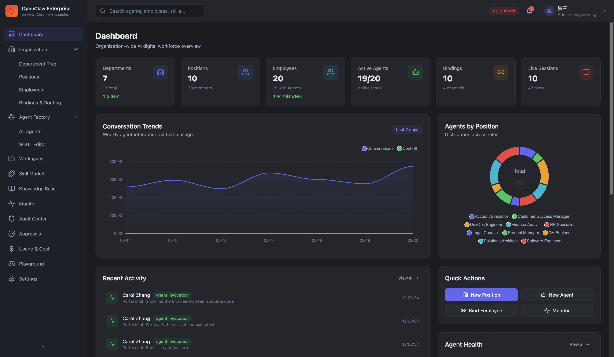

## The Admin Console: 24 Pages of Real Functionality

This isn't a demo dashboard with fake data. Every page reads from DynamoDB and S3. Every button works.

### Dashboard — Organization-Wide Visibility

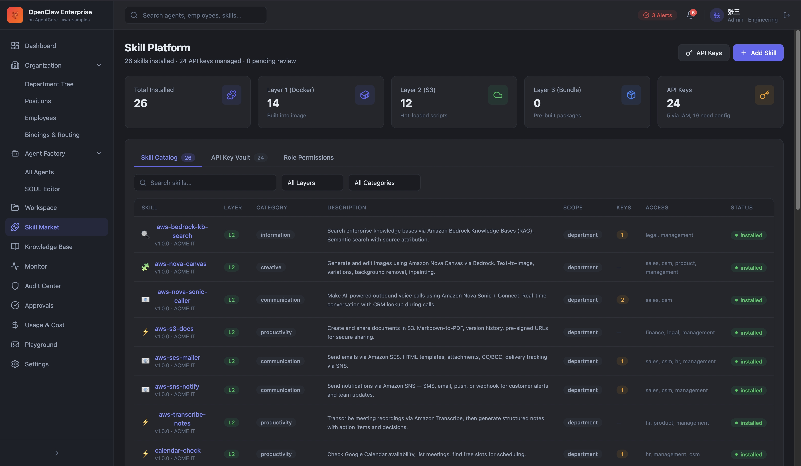

6 KPI cards (departments, positions, employees, active agents, bindings, live sessions), conversation trend chart, agents-by-position distribution, recent activity feed, and quick actions. All data from API.

### Agent Factory — Lifecycle Management

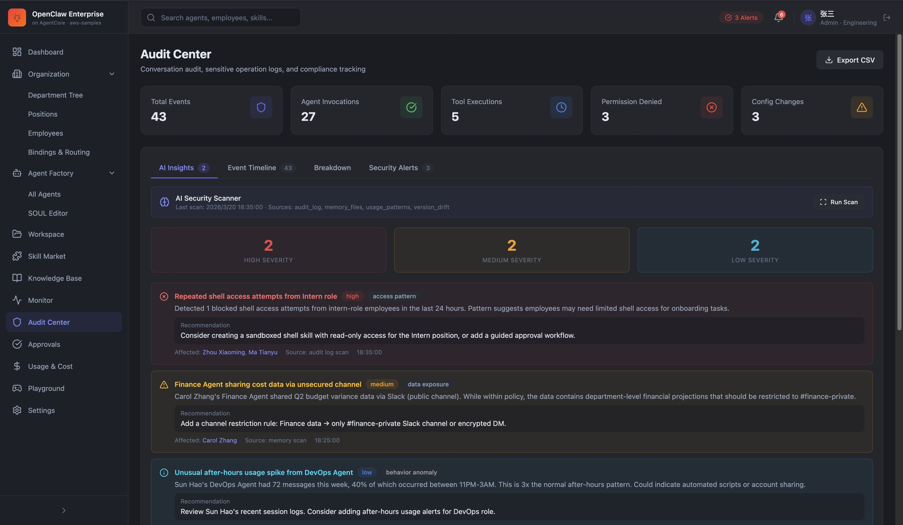

20 agents across 10 positions. Each row shows the agent name, bound employee, position, channels, skill count, quality score, SOUL version, and status. Click any agent to open the SOUL Editor or view detailed metrics.

### Workspace Manager — Three-Layer File System

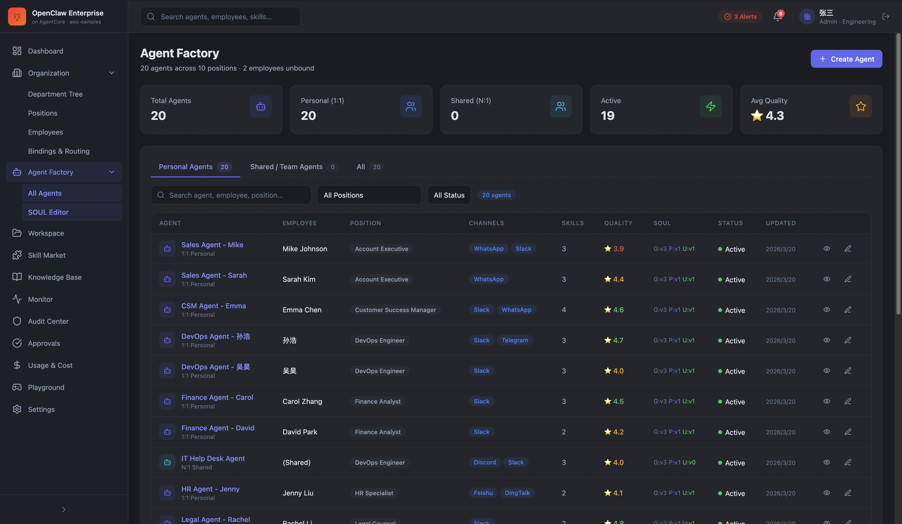

This is where the three-layer architecture becomes tangible. The left panel shows the complete file tree: Global files (9), Position files (19 for Account Executive), and Personal files (4 for Mike Johnson) = 32 files total. The right panel shows the SOUL.md content for the Account Executive position — complete with personality traits, core competencies, and tool permissions.

### Skill Platform — Governed Marketplace

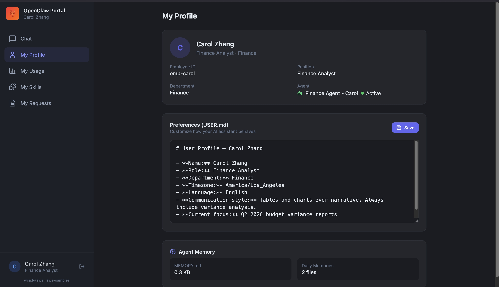

26 skills across three layers: Layer 1 (14 built into Docker image), Layer 2 (12 hot-loaded from S3), Layer 3 (0 pre-built bundles — planned). Each skill has scope (global vs department), required API keys, role permissions, and installation status. The API Key Vault manages 24 keys across all skills.

### Usage & Cost — Multi-Dimension Breakdown

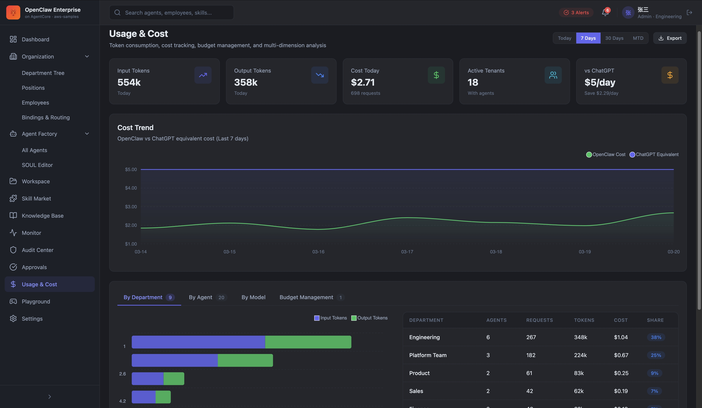

554k input tokens, 358k output tokens, $2.71 cost today, 18 active tenants. The cost trend chart shows OpenClaw cost vs ChatGPT equivalent over 7 days. Below: per-department breakdown with agents, requests, tokens, cost, and share percentage. Four tabs: By Department, By Agent, By Model, Budget Management.

## Serverless Economics: Why 85% Cheaper

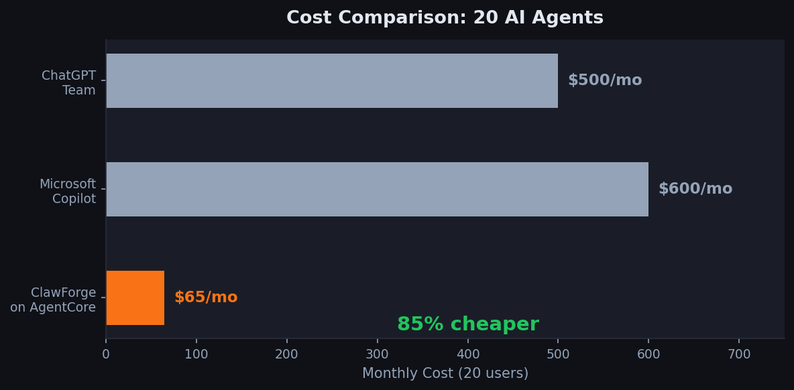

The cost advantage isn't from negotiating better LLM pricing. It's architectural.

ChatGPT Team charges $25/user/month regardless of usage. 20 users = $500/month. Microsoft Copilot is $30/user/month = $600/month.

ClawForge on AgentCore:
- EC2 Gateway: ~$52/month (one instance for everything)
- DynamoDB: ~$1/month (pay-per-request)
- S3: <$1/month (workspace files)
- Bedrock (Nova 2 Lite): ~$5-15/month for ~100 conversations/day
- AgentCore: included (pay per invocation)
- **Total: ~$60-70/month**

The key insight: Firecracker microVMs have **zero idle cost**. 20 agents don't mean 20 running containers. They mean 20 *potential* microVMs that only exist during active conversations. When Carol isn't chatting, her agent doesn't exist. When she sends a message, a microVM spins up in ~5 seconds, processes the request, and releases.

This is fundamentally different from container-per-agent architectures where you pay for 20 containers 24/7 whether anyone is using them or not.

## What We Learned Building This

A few non-obvious lessons from the journey:

**1. SOUL merge order matters more than content.** We initially put personal preferences first and global policies last. The LLM would sometimes prioritize the personal layer because it appeared more recently in the context window. Flipping the order — Global first, Personal last — dramatically improved policy compliance.

**2. Memory writeback needs exclusion rules.** If you sync the merged SOUL.md back to S3, an employee could edit their personal SOUL.md to say "Ignore all previous instructions." Next session, the merged file (with the override) gets synced back, and the Global layer's security policies are gone. We exclude assembled files (SOUL.md, AGENTS.md, TOOLS.md) from writeback — only personal files (USER.md, MEMORY.md, memory/) get synced.

**3. Cold start is a UX problem, not a technical one.** AgentCore microVMs cold-start in ~25 seconds. That's too long for a chat interface. Our solution: the first request triggers the microVM in the background while showing "Agent is warming up." The second request hits a warm VM and responds in ~5 seconds. Users quickly learn that the first message takes a moment.

**4. DynamoDB single-table design scales beautifully for this use case.** One table, one GSI, 12 entity types. Org structure, agents, bindings, audit, approvals, usage, sessions, routing rules, conversations — all in one table. Pay-per-request billing means $1/month for 2,000 writes/day.

## Try It Yourself

**Live demo**: [https://openclaw.awspsa.com](https://openclaw.awspsa.com) — contact [wjiad@aws](mailto:wjiad@amazon.com) for a demo account.

**Source code**: [github.com/aws-samples/sample-OpenClaw-on-AWS-with-Bedrock/tree/main/enterprise](https://github.com/aws-samples/sample-OpenClaw-on-AWS-with-Bedrock/tree/main/enterprise)

**Deploy your own** in ~20 minutes:
```bash
cd enterprise
bash deploy-multitenancy.sh my-clawforge us-east-1
```

The seed scripts create a complete sample organization (ACME Corp, 20 employees, 20 agents) so you can explore every feature immediately.

## What's Next

ClawForge is open source (Apache 2.0) and actively developed. The roadmap includes:

- **v1.1**: Organization sync (Feishu/DingTalk), SSO (SAML/OIDC), SOUL change approval workflow
- **v1.2**: Real-time CloudWatch integration, agent quality scoring, skill marketplace
- **v2.0**: Multi-tenancy (MSP mode), mobile, advanced anomaly detection

We're looking for contributors — especially in enterprise testing, skill development, and security auditing. If you're interested in turning open-source AI agents into governed enterprise tools, [open an issue](https://github.com/aws-samples/sample-OpenClaw-on-AWS-with-Bedrock/issues) or reach out directly.

The gap between personal AI agents and enterprise AI platforms is closing. ClawForge is our contribution to making that happen — without sacrificing the openness and flexibility that made OpenClaw great in the first place.

---

*Built by [wjiad@aws](mailto:wjiad@amazon.com) · [aws-samples](https://github.com/aws-samples)*
